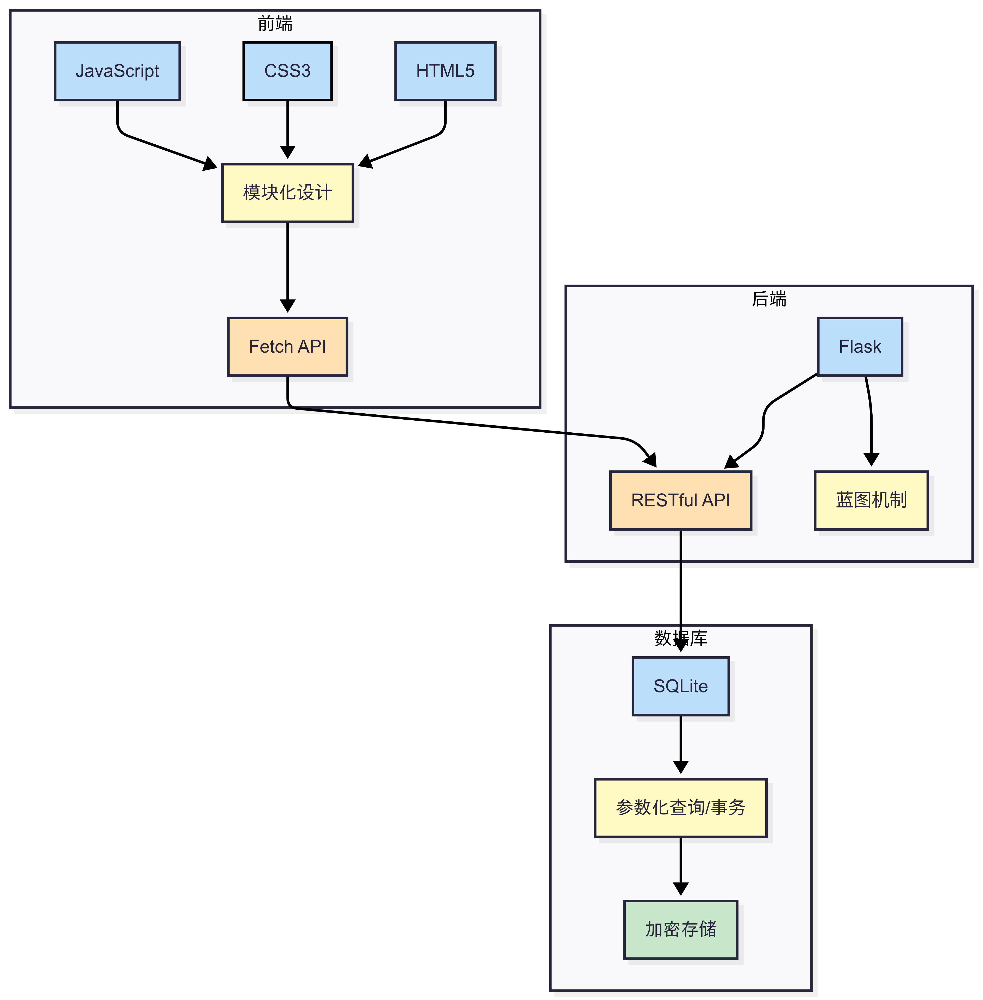
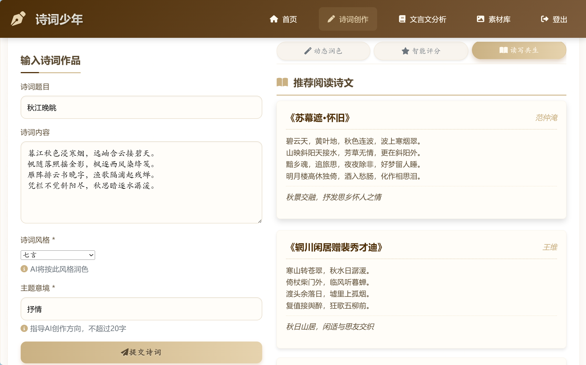
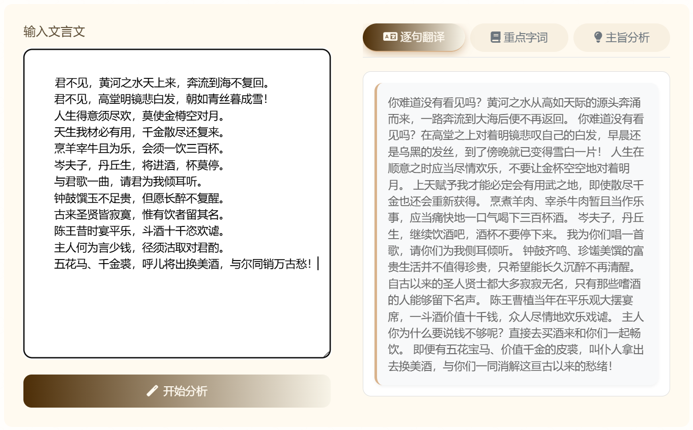
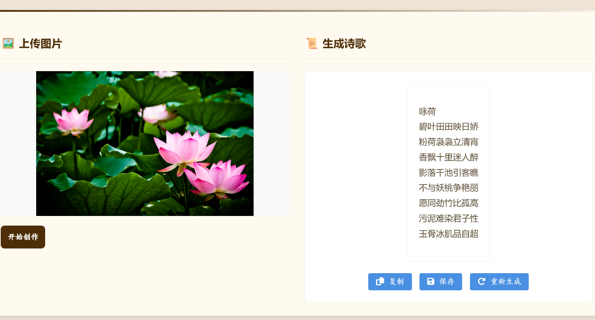

# 诗词少年 - AI 诗词写作助手  

## 项目介绍  
"诗词少年"是面向中学生的智能古诗文学习助手，依托 AI 技术实现 **诗词创作、文言文分析、素材查询、图文生成** 四大核心功能，助力用户理解古典诗词精髓，提升创作能力，传承传统文化。  


## 技术架构设计  
采用 **前后端分离架构**，通过标准化接口实现数据流转，保障扩展性与可维护性：  

### 三层架构示意图  


#### 模块解析：  
- **前端层**：  
  以 **HTML5 + CSS3 + JavaScript** 构建模块化界面，通过 **Fetch API** 发起异步请求，与后端 RESTful API 交互。  

- **后端层**：  
  基于 **Flask 框架** 开发，通过 **蓝图机制** 拆分功能模块（如诗词创作、文言文分析），实现代码解耦；对外提供 RESTful API 接口。  

- **数据层**：  
  采用 **SQLite 轻量数据库**，通过 Python 驱动实现：  
  - ✅ **参数化查询**：防止 SQL 注入攻击  
  - ✅ **事务管理**：保证数据操作原子性  
  - ✅ **加密存储**：敏感数据（如用户信息）加密处理    


## 核心界面演示  

### 1. 诗词润色页（文韵雕琢）
提交原创作品，AI 基于 **风格/主题** 精细化润色，附带 **智能评分、历史记录** 功能：  



### 2. 文言文分析页（深度解析）  
支持 **逐句翻译、重点字词解析、主旨分析**，攻克古文理解难点：  



### 3. 图文生成页（创意融合）  
上传图片自动生成七言律诗，实现“以图赋词”，支持 **保存/重新创作**：  



### 4. 诗词润色页（专业打磨）  
提交原创作品，AI 基于 **风格/主题** 精细化润色，附带 **智能评分、历史记录** 功能：  


## 核心功能  
| 功能模块         | 具体能力                                                                 | 对应界面               |  
|------------------|--------------------------------------------------------------------------|------------------------|  
| 诗词创作         | 多风格生成、润色、评分，历史记录管理                                     | 诗词润色页             |  
| 文言文分析       | 通假字、古今异义、词类活用、特殊句式解析                                 | 文言文分析页           |  
| 素材库           | 关键词检索诗词素材，含作者/出处/应用价值分析                             | 推荐阅读页（拓展功能） |  
| 图文生成         | 图片→七言律诗，支持作品保存/重新生成                                     | 图文生成页             |  


## 环境配置  

### 方法一：Conda 环境  
```bash  
# 创建虚拟环境  
conda create -n writingassistant python=3.11  
conda activate writingassistant  

# 安装依赖  
pip install -r requirements.txt  
```  

### 方法二：env.yml 一键配置  
```bash  
conda env create -f env.yml  
conda activate writingassistant  
```  

### 方法三：Poetry 管理  
```bash  
# 安装 Poetry（若未安装）  
pip install poetry  

# 安装依赖  
poetry install  
```  


## 技术栈  
| 维度     | 技术选型                                                                 |  
|----------|--------------------------------------------------------------------------|  
| 后端     | Python 3.11、Flask（蓝图机制）、RESTful API                              |  
| 前端     | HTML5、CSS3、JavaScript（模块化设计）、Fetch API                         |  
| 数据库   | SQLite（参数化查询、事务、加密存储）                                     |  
| AI 支持  | OpenAI API                                                               |  
| 部署     | PyInstaller（打包）、Waitress（生产部署）                                |  


## 文件结构  
```  
WritingAssistant  
├─ env.yml                  # Conda 环境配置  
├─ poetry.lock              # Poetry 依赖锁文件  
├─ pyproject.toml           # 项目依赖配置  
├─ README.md                # 项目文档（当前文件）  
├─ test                     # 测试用例  
│  ├─ classicalChinese.txt  # 文言文测试文本  
│  └─ poem.txt              # 诗词测试文本  
├─ uploads                  # 上传文件存储（图片、作品等）  
│  └─ 夏蝉.json             # 示例文件  
└─ writing_assistant        # 主应用目录  
   ├─ app.py                # 应用入口  
   ├─ blueprints            # 功能蓝图（解耦模块）  
   │  ├─ auth.py            # 认证模块（登录/注册）  
   │  ├─ classicalChinese.py # 文言文分析模块  
   │  ├─ home.py            # 首页（推荐阅读）  
   │  ├─ material.py        # 素材库模块  
   │  ├─ paint.py           # 图文生成模块  
   │  └─ poem.py            # 诗词创作模块  
   ├─ db                    # 数据库操作  
   │  ├─ init_db.py         # 数据库初始化（建表）  
   │  └─ users.db           # 用户数据库（SQLite）  
   ├─ static                # 静态资源  
   │  ├─ css                # 样式表  
   │  ├─ images             # 界面图片（含架构图、演示图）  
   │  └─ js                 # 前端交互脚本  
   └─ templates             # 页面模板  
      ├─ classicalChinese.html # 文言文分析页  
      ├─ index.html         # 推荐阅读页（首页）  
      ├─ login.html         # 登录页  
      ├─ material.html      # 素材库页  
      ├─ paint.html         # 图文生成页  
      ├─ poem.html          # 诗词润色页  
      └─ register.html      # 注册页  
```  


## 使用说明  
1. **启动应用**：  
   ```bash  
   python writing_assistant/app.py  
   ```  

2. **访问地址**：`http://localhost:5000`  

3. **功能导航**：  
   - 素材积累 → 首页（推荐阅读）  
   - 古文解析 → 文言文分析页  
   - 图文创作 → 图文生成页  
   - 诗词打磨 → 诗词润色页  


## 版权声明  
© 2025 蓝心执笔人团队 | 基于 AI 助力诗词创作，传承中华传统文化  


 

**提示**：若部署时缺少依赖，可通过 `requirements.txt` 或 `poetry` 补充安装；静态资源（如演示图片）需放置在 `static/images` 目录下。
